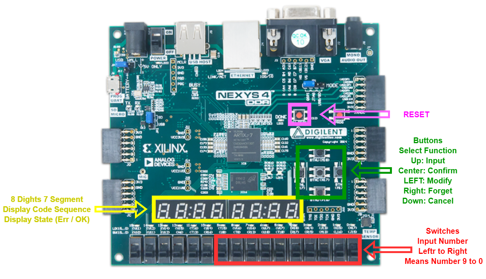
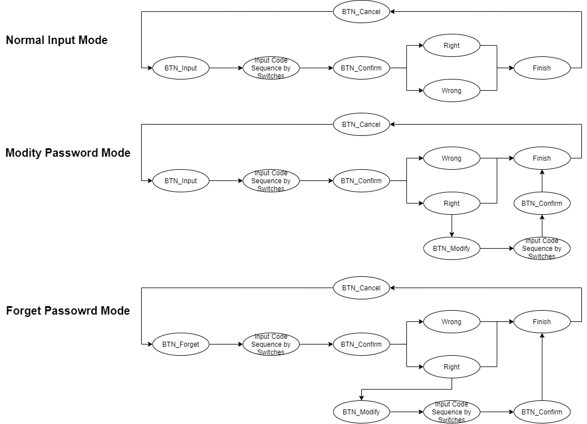
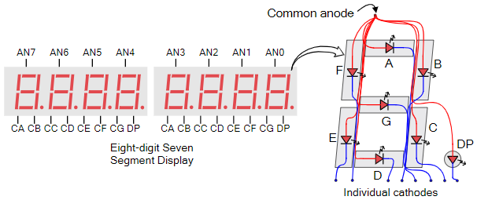

# University of Birmingham, 2020 Digit Design Assigment: An Combination Lock
Using VHDL language and implement on Nexys4 DDR ,design by Yifan Du
* [Hardware Specification](#hardware-specification)
* [Button Function Specification](#button-function-specification)
* [Theory](#Theory)
   * [Clock Divider](#Clock-Divider)
   * [8 Digits 7 Segment Display](#8-Digits-7-Segment-Display)
---
## **Hardware Specification**

- **RESET**: Reset all value, code sequence and password

- **Buttons**: Use button to entry differnet function (mode).
   - **UP**: Normal input mode
   - **Left**: Modify password mode, only working afer input right code sequence
   - **Center**: Confirm button, when user finfish input, push this button to confirm input code sequence.  
   - **Right**: Forget password mode / Admain mode
   - **Down**: Cancel / exit button.

- **8 Dight 7 Segments**: Initial state will display "_"

- **Switches**: Push up then push down same switch, its means input one number   
   - *e.g*: push up switch [4] then push down, its means input deciaml number 4

----
## **Button Function Specification**


> Input whole code sequence then push confirm (center) button 
>> *e.g* Input code sequence 0123, switch[0]-up-down -> switch[1]-up-down -> switch[2]-up-down -> switch[3]-up-down

----
## **Theory**
* ### **Clock Divider**


firstly, XC7A000T main frequency = 100Mhz = 100,000,000Hz

if we want create 100Hz clock by using 100MHz clock, so the counter limit we need is 1,000,000


 we need to use counter limit divided by 2, because there has high-level and low-level in one cycle.


So, its mean when counter is equal to 500000, we change the "CLK100Hz" e.g: high-level -> low-level
5000000 in hex is 7A120, and has 18 bit in binary

## Code Implement

```VHDL
library IEEE;
use IEEE.STD_LOGIC_1164.ALL;
use IEEE.STD_LOGIC_ARITH.ALL;
use IEEE.STD_LOGIC_UNSIGNED.ALL;

entity main is
    PORT(
        CLK100MHZ : in  std_logic;        
        RESET_N   : in  std_logic
    );
end main;

architecture Behavioral of main is
    signal counter  : std_logic_vector (17 downto 0); -- 500000 in binary has 18 bit
    signal CLK100Hz : std_logic; -- Create clock
begin
    process(CLK100MHZ, RESET_N)
    begin
        if RESET_N = '1' then
            CLK100Hz <= '0';
            counter <= (others => '0');     -- clear counter
        elsif rising_edge(CLK100MHZ) then   
            if counter = X"7A120" then      -- 500000 in hex
                counter <= (others => '0');
                CLK100Hz <= not CLK100Hz;
            else
                counter <= counter + "1";
            end if;
        end if;
    end process;
end Behavioral;
```

* ### **8 Digits 7 Segment Display**


It can not display a different number in the same time, basically, we use a scan signal to display a single number in a single bit and turn off others bit in the same time, when scan signal has high frequency, its looks like a string of numbers, but the frequency can not be too high, otherwise, it looks like there have nothing on the digital tube. i tried a lot of frequence, finally, 800Hz is working great for this.

Because it is common anode digital tube, so high-level is turn off, low-level is turn on

|Number|A|B|C|D|E|F|G|
|:-|:-:|:-:|:-:|:-:|:-:|:-:|:-:|:-:|
|None|1|1|1|1|1|1|1|
|0/O|1|0|0|0|0|0|0|
|1|1|1|1|1|0|0|1|
|2|0|1|0|0|1|0|0|
|3|0|1|1|0|0|0|0|
|4|0|0|1|1|0|0|1|
|5|0|0|1|0|0|1|0|
|6|0|0|0|0|0|1|0|
|7|1|1|1|1|0|0|0|
|8|0|0|0|0|0|0|0|
|9|0|0|1|0|0|0|0|
|K|0|0|0|1|0|0|1|
|E|0|0|0|0|1|1|0|
|r|0|1|0|1|1|1|1|
|_|1|1|1|0|1|1|1|
I use 8 digits 7 segments display to show input code sequence and result "Err" / "Ok"

